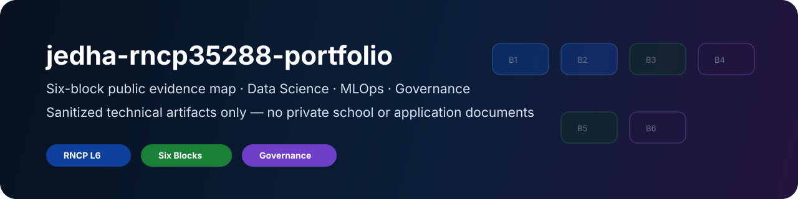

# jedha-rncp35288-portfolio

<div align="center">



<br/>

**Public, sanitized technical evidence portfolio for the Jedha Data Science & AI certification track**

RNCP Level 6 · Six-block evidence · Data Infrastructure · EDA · ML · NLP · MLOps · Project Governance


</div>

---

## Executive summary

This repository is a **public sanitized evidence portfolio** for the Jedha Data Science & AI RNCP Level 6 six-block track.

It is designed to organize technical evidence without publishing private school documents, exam materials, grades, certificates with personal identifiers, CPF documents, contracts, invoices or application material.

The portfolio maps technical artifacts to six competency blocks:

```text
data infrastructure -> EDA/statistics -> machine learning -> NLP/deep learning -> MLOps deployment -> project governance
```

---

## Public-safety boundary

This repository must never contain:

- private Jedha course content;
- exam subjects or answers;
- grades;
- private certificates with identifiers;
- administrative PDFs;
- CPF files;
- contracts or invoices;
- CVs or cover letters;
- employer-specific applications;
- real banking, insurance, health, client or employer data;
- secrets, tokens or credentials.

Allowed:

- personal technical code;
- sanitized screenshots;
- synthetic or open datasets;
- architecture diagrams;
- model cards;
- data cards;
- runbooks;
- project governance documents;
- evidence index.

---

## Six-block evidence map

| Block | Public evidence folder | Technical signal |
|---|---|---|
| Bloc 1 — Data infrastructure | `bloc_1_data_infrastructure/` | ingestion, SQL, schema, data quality, architecture |
| Bloc 2 — EDA / statistics | `bloc_2_eda_statistics/` | analysis, distributions, anomalies, hypothesis testing |
| Bloc 3 — Machine learning | `bloc_3_machine_learning/` | supervised/unsupervised ML, evaluation, explainability |
| Bloc 4 — NLP / deep learning | `bloc_4_nlp_deep_learning/` | text processing, document classification, GenAI foundations |
| Bloc 5 — Industrialization / MLOps | `bloc_5_mlops_deployment/` | API, Docker, MLflow, tests, monitoring |
| Bloc 6 — Project governance | `bloc_6_project_governance/` | project charter, risk register, model/data governance |

---

## Relationship with the broader portfolio

This repository should reference, not duplicate, the technical repos:

| External repo | Related block |
|---|---|
| `banking-dataops-monitoring` | Bloc 1, Bloc 6 |
| `fraud-mlops-control-tower` | Bloc 3, Bloc 5, Bloc 6 |
| `database-migration-quality-lab` | Bloc 1, Bloc 6 |
| `secure-wealth-rag-assistant` | Bloc 4, Bloc 6 |
| `sovralys-infra-lab` | Bloc 1, Bloc 5 |
| `pty-flights-pricing` | Bloc 1, operational automation evidence |

---

## Repository structure

```text
jedha-rncp35288-portfolio/
├── README.md
├── PORTFOLIO.md
├── LICENSE
├── .gitignore
├── assets/
│   └── jedha-portfolio-banner.svg
├── docs/
│   ├── certification_mapping.md
│   ├── evidence_index.md
│   ├── public_safety_rules.md
│   ├── portfolio_review_checklist.md
│   └── templates/
├── bloc_1_data_infrastructure/
├── bloc_2_eda_statistics/
├── bloc_3_machine_learning/
├── bloc_4_nlp_deep_learning/
├── bloc_5_mlops_deployment/
└── bloc_6_project_governance/
```

---

## How to use this repo

1. Keep private school/admin documents outside GitHub.
2. Add only sanitized technical evidence.
3. Link to dedicated project repos when evidence belongs there.
4. Update `docs/evidence_index.md` after every added artifact.
5. Run public-safety review before every push.

---

## Non-goals

This repository is not:

- a dump of school files;
- a private certificate folder;
- a place for applications;
- a place for grades;
- a copy of Jedha course content;
- a production data/ML system.

---

## Portfolio signal

This repo proves structure, traceability and documentation discipline across the complete Data / MLOps certification track, while keeping sensitive material private.
